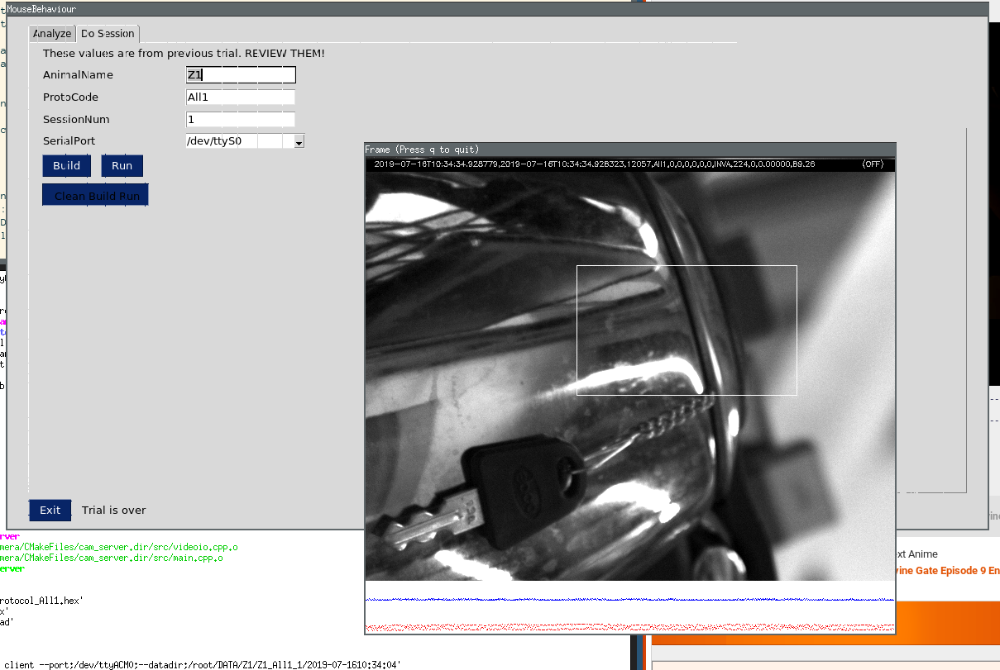

Docker is the recommended to run this pipeline. To get the required image,
execute `docker pull bhallalab/mousebehaviour` in the terminal.

??? note "Installing Docker"

    __Installing and checking docker__

    Follow [these instruction to install docker](https://docs.docker.com/install).
    Also see [these
    instructions](https://docs.docker.com/config/daemon/systemd/#httphttps-proxy)
    for adding proxy support to docker. To check that docker works fine, execute
    following in the terminal.

    ~~~bash
    $ docker run hello-world
    ~~~

    I saw the following output.

    ~~~
    Unable to find image 'hello-world:latest' locally
    latest: Pulling from library/hello-world
    1b930d010525: Pull complete 
    Digest: sha256:6540fc08ee6e6b7b63468dc3317e3303aae178cb8a45ed3123180328bcc1d20f
    Status: Downloaded newer image for hello-world:latest

    Hello from Docker!
    . 
    .
    ~~~

# Docker

The docker image is available at
https://hub.docker.com/r/bhallalab/mousebehavioum. You can get it by executing
the following:

~~~bash
$ docker pull bhallalab/mousebehaviour
~~~

Before we run this image, we must make sure that docker can access
devices connected to host computer. We also need to collect data 
generated inside the docker during experiment and save it to the host machine.

!!! note
    Type `xhost +` once in the terminal. This makes docker to access
    graphics. You have to do it just once.

Following command inside the terminal did the job for me. 

Make sure that camera and Arduino Uno board are connected to host computer.
Camera requires `USB3.0` if you want high frame rate. We were able to get 200
FPS.

~~~bash
# camera and arduino must be connected.
docker run --rm \
    --net=host --privileged \
    -v /dev:/dev \
    -e DISPLAY=$(DISPLAY) \
    -v /tmp/.X11-unix:/tmp/.X11-unix \
    -v $(HOME)/.Xauthority:/root/.Xauthority \
    -v $(HOME)/DATA:/root/DATA \
    -it bhallalab/mousebehaviour
~~~

And voila, you should see this gui. More information is [here](gui.md). When in
doubt, hover your mouse pointer on gui and a helpful message should pop-up
(hopefully).

# Ubuntu 16.04

If you can't use docker, you can build and run the pipeline in Ubuntu-16.04
based system. The camera firmware version which we have used is compatible with
Ubuntu-16.04. The vendor also supports Ubuntu-18.04 but we have not ported our
code to this Ubuntu-18.04 yet.

1. Create an admin account, say `chuha` (Hindi for mouse). Login.
2. Add `chuha` to following groups: 
    - `dialout` To access arduino.
    - `pgrimaging` To access PointGrey camera (Also see `udev` related note).
    Following script should do the job.

    ~~~bash
    $ sudo groupadd -f dialout
    $ sudo groupadd -f pgrimaging
    $ sudo usermod -a -G dialout,pgrimaging chuha
    ~~~

    ==Logout and login again.== Changes to group takes effect on a fresh login.

3. (__udev__) Add `udev` rules. We need them for accessing camera events.

     ~~~bash
     $ mkdir -p /etc/udev/rules.d 
     $ echo "SUBSYSTEM==\"usb\", GROUP=\"pgrimaging\"" >/etc/udev/rules.d/40-pgr.rules
     $ /etc/init.d/udev restart
     ~~~

- Install python3.6. The GUI and analysis scripts requires python3.6 or higher.
   It is not available in official repositories, so we need to use a ppa.
    ~~~bash
    $ sudo add-apt-repository ppa:deadsnakes/ppa
    $ sudo apt-get update
    $ sudo apt-get install python3.6-tk python3.6-venv python3.6-dev
    ~~~

-  Install required packages using `apt`.
    ~~~bash
    $ sudo apt-get install -y cmake g++ git
    $ sudo apt-get install -y libboost-all-dev libopencv-dev libserial-dev arduino-core
    ~~~

- Create `python3.6` virtualenv and enable it.
    ~~~bash
    $ python3.6 -m venv ~/PY36
    $ source ~/PY36/bin/activate 
    ~~~
   To make sure that python3.6 becomes default python, add `source
   ~/PY36/bin/activate` to your `~/.bashrc` or `~/.profile` file. For more, see
   the official documentations https://docs.python.org/3.6/tutorial/venv.html

- Install required python packages.
    ~~~bash
    $ pip install -r  matplotlib scipy tables screeninfo numpy pandas pyserial pysimplegui pillow
    ~~~

!!! note "One script to do this all"
    This all is collected in one scripts `./scripts/bootstrap.sh`. Use it at your
    own risk.

And we are done. Lets launch the gui `$ python gui.py`.

# GUI

GUI has two tabs. First is to analyse the `tiff` files generated during the
session and, second one to run the session.
